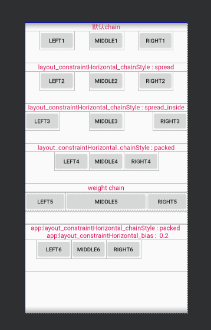
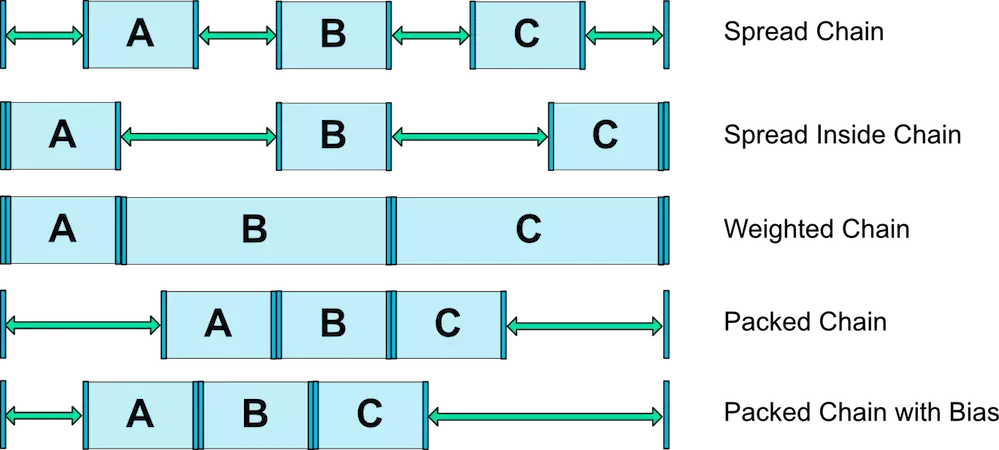
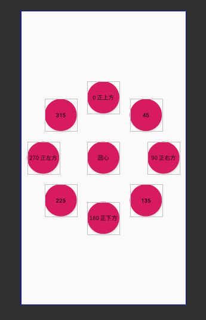
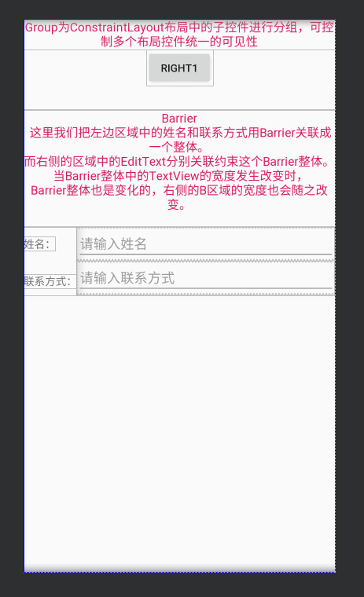

[带你了解 Android 约束布局 ConstraintLayout](https://mp.weixin.qq.com/s/JijR16p-DjlsZz8wn5D-PQ)

[约束布局ConstraintLayout用法全解析](https://mp.weixin.qq.com/s/9GrZa4pGBIPDHmyveqhL1A)

[掌握ConstraintLayout系列](http://examplecode.cn/categories/Android%E5%BC%80%E5%8F%91/)

[ConstraintLayout中Chains和Guideline的使用](https://www.jianshu.com/p/2c125a8074ca)

[ConstraintLayout(约束布局)的使用](https://www.jianshu.com/p/106e4282a383)

# 优缺点：

ConstraintLayout具有以下优势：

较高的性能优势

布局嵌套层次越高，性能开销越大。而使用ConstraintLayout，经常就一层嵌套就搞定了，所以其性能要好很多。

完美的屏幕适配

ConstraintLayout的大小、距离都可以使用比例来设置，所以其适配性更好。

书写简单

可视化编辑

缺点：

缺点就是调整布局特别是删除一个控件时如果依赖关系比较多时就很麻烦。不过Google爸爸建议使用ConstraintLayout替代RelativeLayout，而且从性能上也比RelativeLayout要好

对于控件的Id定义是一件头疼的事情。还有删除一个控件 就需要动依赖这个控件的所有布局。代码量偏多

# 报错

This view is not constrained vertically: at runtime it will jump to the top unless you add a vertical constraint less... (Ctrl+F1) 
Inspection info:The layout editor allows you to place widgets anywhere on the canvas,
and it records the current position with designtime attributes (such as layout_editor_absoluteX). 
These attributes are not applied at runtime, so if you push your layout on a device, 
the widgets may appear in a different location than shown in the editor. 
To fix this, make sure a widget has both horizontal and vertical constraints by dragging from the edge connections.  
Issue id: MissingConstraints

必须上下或左右都要有约束

# 相对位置

要在ConstraintLayout中确定view的位置,必须至少添加一个水平和垂直的约束。
每一个约束表示到另一个view，父布局，或者不可见的参考线的连接或者对齐。如果水平或者垂直方向上没有约束，那么其位置就是0。

# 尺寸约束

view中使用warp_content或者固定值等等是没有问题的。
但是ConstraintLayout中不支持MATCH_PARENT这个值，如果需要实现跟MATCH_PARENT同样的效果，
可以使用0dp来代替，其表示MATCH_CONSTRAINT,即适应约束。其跟MATCH_PARENT还是有区别的

# 宽高比

在ConstraintLayout中，还可以将宽定义成高的一个比例或者高定义成宽的比率。
首先，需要将宽或者高设置为0dp（即MATCH_CONSTRAINT），即要适应约束条件。
然后通过layout_constraintDimensionRatio属性设置一个比率即可。
这个比率可以是一个浮点数，表示宽度和高度之间的比率；也可以是“宽度：高度”形式的比率。

Ratio

ConstrainLayout提供了ratio属性，用来限制View的宽高比例。
使用Ratio属性，宽高两个尺寸中至少要一个是MATCH_CONSTRAINT(0dp)
默认情况下，1:2，表示宽:高，宽为1，高为2
宽高都为MATCH_CONSTRAINT时，可以在比例前加W或者H：
W,1:2：表示宽=2，高=1，即H:W = 1:2
H,1:2：表示高=2，宽=1，即W:H = 1:2

# MATCH_CONSTRAINT

ConstraintLayout取消了MATCH_PARENT由MATCH_CONSTRAINT来代替，默认大小占用所有约束可用空间，并提供了以下属性辅助我们使用。
``` 
layout_constraintWidth_min 设置最小宽度
layout_constraintHeight_min 设置最小高度
layout_constraintWidth_max 设置最大宽度
layout_constraintHeight_max 设置最大高度
layout_constraintWidth_percent 设置宽度相对父类宽度百富比
layout_constraintHeight_percent 设置高度相对父类高度的百分比
```

# 百分比宽高


ConstraintLayout还能使用百分比来设置view的宽高。
要使用百分比，宽或高同样要设置为0dp（MATCH_CONSTRAINT）。
然后设置以下属性即可：
``` 
app:layout_constraintWidth_default="percent" //设置宽为百分比
app:layout_constraintWidth_percent="0.3" //0到1之间的值
或
app:layout_constraintHeight_default="percent" //设置高为百分比
app:layout_constraintHeight_percent="0.3" //0到1之间的值
```

# 位置偏向

如果想让view的位置偏向某一侧，可以使用以下的两个属性来设置：
``` 
layout_constraintHorizontal_bias  //水平偏向
layout_constraintVertical_bias  //竖直偏向
```
其值同样也是0到1之间。

bias即偏移量,他们的取值范围从0~1，0即挨着左边，1是挨着右边，所以要使处于1/3处，可以设置如下属性app:layout_constraintHorizontal_bias="0.33"

# Guideline

Guideline，是一个辅助控件，可见性为GONE，主要作用是充当一个锚点。

设置Guidline的方向：
``` 
android:orientation="horizontal"：高度0dp，宽度与父容器等宽
android:orientation="vertical"：宽度0dp，高度与父容器等高

```
设置Guidline的位置：
``` 
layout_constraintGuide_begin：距离父容器左边或者顶部的距离
layout_constraintGuide_end：距离父容器右边或者底部的距离
layout_constraintGuide_percent：距离父容器左边或者顶部的距离占父容器的宽或者高的百分比
```


# layout_marginStart与layout_marginLeft的区别

有两种阅读方式，从左到右（left-to-right，即LTR）和从右到左（right-to-left，即RTL）。
简单来说，对于LTR，start、end等同于left、right；而对于RTL，则相反。
为了使用RTL布局，需要实现以下两点：

在AndroidManifest中声明支持RTL布局：在 <application>元素下添加android:supportsRtl="true"声明。
在App中用start、end来替代left、right：


如果用4.2及以上编译（ targetSdkVersion或者minSdkVersion大于等于17），则start、end来替代left、right，例如：android:paddingLeft 应改为android:paddingStart

如果用4.2以下编译（ targetSdkVersion或者minSdkVersion小于等于16），两者都必须使用，例如：需要同时使用android:paddingLeft 和android:paddingStart


# chain 示例

``` 
<?xml version="1.0" encoding="utf-8"?>
<ScrollView xmlns:android="http://schemas.android.com/apk/res/android"
    xmlns:app="http://schemas.android.com/apk/res-auto"
    android:layout_width="match_parent"
    android:layout_height="match_parent"
    android:fillViewport="true">

    <LinearLayout
        android:layout_width="match_parent"
        android:layout_height="wrap_content"
        android:orientation="vertical">

        <!--
            默认chain
        -->
        <TextView
            android:layout_width="match_parent"
            android:layout_height="wrap_content"
            android:gravity="center"
            android:text="默认chain"
            android:textColor="@color/colorAccent"
            android:textSize="16sp" />

        <androidx.constraintlayout.widget.ConstraintLayout
            android:layout_width="match_parent"
            android:layout_height="80dp">

            <Button
                android:id="@+id/left1"
                android:layout_width="wrap_content"
                android:layout_height="wrap_content"
                android:text="left1"
                app:layout_constraintEnd_toStartOf="@id/middle1"
                app:layout_constraintStart_toStartOf="parent"
                app:layout_constraintTop_toTopOf="parent" />

            <Button
                android:id="@+id/middle1"
                android:layout_width="wrap_content"
                android:layout_height="wrap_content"
                android:text="middle1"
                app:layout_constraintEnd_toStartOf="@id/right1"
                app:layout_constraintStart_toEndOf="@+id/left1"
                app:layout_constraintTop_toTopOf="parent" />

            <Button
                android:id="@+id/right1"
                android:layout_width="wrap_content"
                android:layout_height="wrap_content"
                android:text="right1"
                app:layout_constraintEnd_toEndOf="parent"
                app:layout_constraintStart_toEndOf="@id/middle1"
                app:layout_constraintTop_toTopOf="parent" />

        </androidx.constraintlayout.widget.ConstraintLayout>

        <!--
            app:layout_constraintHorizontal_chainStyle="spread"
        -->

        <TextView
            android:layout_width="match_parent"
            android:layout_height="wrap_content"
            android:gravity="center"
            android:text="layout_constraintHorizontal_chainStyle : spread"
            android:textColor="@color/colorAccent"
            android:textSize="16sp" />

        <androidx.constraintlayout.widget.ConstraintLayout
            android:layout_width="match_parent"
            android:layout_height="80dp">

            <Button
                android:id="@+id/left2"
                android:layout_width="wrap_content"
                android:layout_height="wrap_content"
                android:text="left2"
                app:layout_constraintEnd_toStartOf="@id/middle2"
                app:layout_constraintHorizontal_chainStyle="spread"
                app:layout_constraintStart_toStartOf="parent"
                app:layout_constraintTop_toTopOf="parent" />

            <Button
                android:id="@+id/middle2"
                android:layout_width="wrap_content"
                android:layout_height="wrap_content"
                android:text="middle2"
                app:layout_constraintEnd_toStartOf="@id/right2"
                app:layout_constraintStart_toEndOf="@+id/left2"
                app:layout_constraintTop_toTopOf="parent" />

            <Button
                android:id="@+id/right2"
                android:layout_width="wrap_content"
                android:layout_height="wrap_content"
                android:text="right2"
                app:layout_constraintEnd_toEndOf="parent"
                app:layout_constraintStart_toEndOf="@id/middle2"
                app:layout_constraintTop_toTopOf="parent" />

        </androidx.constraintlayout.widget.ConstraintLayout>

        <!--
              app:layout_constraintHorizontal_chainStyle="spread_inside"
        -->

        <TextView
            android:layout_width="match_parent"
            android:layout_height="wrap_content"
            android:gravity="center"
            android:text="layout_constraintHorizontal_chainStyle : spread_inside"
            android:textColor="@color/colorAccent"
            android:textSize="16sp" />

        <androidx.constraintlayout.widget.ConstraintLayout
            android:layout_width="match_parent"
            android:layout_height="80dp">

            <Button
                android:id="@+id/left3"
                android:layout_width="wrap_content"
                android:layout_height="wrap_content"
                android:text="left3"
                app:layout_constraintEnd_toStartOf="@id/middle3"
                app:layout_constraintHorizontal_chainStyle="spread_inside"
                app:layout_constraintStart_toStartOf="parent"
                app:layout_constraintTop_toTopOf="parent" />

            <Button
                android:id="@+id/middle3"
                android:layout_width="wrap_content"
                android:layout_height="wrap_content"
                android:text="middle3"
                app:layout_constraintEnd_toStartOf="@id/right3"
                app:layout_constraintStart_toEndOf="@+id/left3"
                app:layout_constraintTop_toTopOf="parent" />

            <Button
                android:id="@+id/right3"
                android:layout_width="wrap_content"
                android:layout_height="wrap_content"
                android:text="right3"
                app:layout_constraintEnd_toEndOf="parent"
                app:layout_constraintStart_toEndOf="@id/middle3"
                app:layout_constraintTop_toTopOf="parent" />

        </androidx.constraintlayout.widget.ConstraintLayout>

        <!--
            app:layout_constraintHorizontal_chainStyle="packed"
        -->
        <TextView
            android:layout_width="match_parent"
            android:layout_height="wrap_content"
            android:gravity="center"
            android:text="layout_constraintHorizontal_chainStyle : packed"
            android:textColor="@color/colorAccent"
            android:textSize="16sp" />

        <androidx.constraintlayout.widget.ConstraintLayout
            android:layout_width="match_parent"
            android:layout_height="80dp">

            <Button
                android:id="@+id/left4"
                android:layout_width="wrap_content"
                android:layout_height="wrap_content"
                android:text="left4"
                app:layout_constraintEnd_toStartOf="@id/middle4"
                app:layout_constraintHorizontal_chainStyle="packed"
                app:layout_constraintStart_toStartOf="parent"
                app:layout_constraintTop_toTopOf="parent" />

            <Button
                android:id="@+id/middle4"
                android:layout_width="wrap_content"
                android:layout_height="wrap_content"
                android:text="middle4"
                app:layout_constraintEnd_toStartOf="@id/right4"
                app:layout_constraintStart_toEndOf="@+id/left4"
                app:layout_constraintTop_toTopOf="parent" />

            <Button
                android:id="@+id/right4"
                android:layout_width="wrap_content"
                android:layout_height="wrap_content"
                android:text="right4"
                app:layout_constraintEnd_toEndOf="parent"
                app:layout_constraintStart_toEndOf="@id/middle4"
                app:layout_constraintTop_toTopOf="parent" />

        </androidx.constraintlayout.widget.ConstraintLayout>

        <!--
            android:layout_width="0dp"
            app:layout_constraintHorizontal_weight="1"
        -->

        <TextView
            android:layout_width="match_parent"
            android:layout_height="wrap_content"
            android:gravity="center"
            android:text="weight chain"
            android:textColor="@color/colorAccent"
            android:textSize="16sp" />

        <androidx.constraintlayout.widget.ConstraintLayout
            android:layout_width="match_parent"
            android:layout_height="80dp">

            <Button
                android:id="@+id/left5"
                android:layout_width="0dp"
                android:layout_height="wrap_content"
                android:text="left5"
                app:layout_constraintEnd_toStartOf="@id/middle5"
                app:layout_constraintHorizontal_weight="1"
                app:layout_constraintStart_toStartOf="parent"
                app:layout_constraintTop_toTopOf="parent" />

            <Button
                android:id="@+id/middle5"
                android:layout_width="0dp"
                android:layout_height="wrap_content"
                android:text="middle5"
                app:layout_constraintEnd_toStartOf="@id/right5"
                app:layout_constraintHorizontal_weight="2"
                app:layout_constraintStart_toEndOf="@+id/left5"
                app:layout_constraintTop_toTopOf="parent" />

            <Button
                android:id="@+id/right5"
                android:layout_width="0dp"
                android:layout_height="wrap_content"
                android:text="right5"
                app:layout_constraintEnd_toEndOf="parent"
                app:layout_constraintHorizontal_weight="1"
                app:layout_constraintStart_toEndOf="@id/middle5"
                app:layout_constraintTop_toTopOf="parent" />

        </androidx.constraintlayout.widget.ConstraintLayout>


        <!--
                app:layout_constraintHorizontal_bias="0.2"
                app:layout_constraintHorizontal_chainStyle="packed"
        -->
        <TextView
            android:layout_width="match_parent"
            android:layout_height="wrap_content"
            android:gravity="center"
            android:text="app:layout_constraintHorizontal_chainStyle : packed \n  app:layout_constraintHorizontal_bias :  0.2"
            android:textColor="@color/colorAccent"
            android:textSize="16sp" />

        <androidx.constraintlayout.widget.ConstraintLayout
            android:layout_width="match_parent"
            android:layout_height="80dp">

            <Button
                android:id="@+id/left6"
                android:layout_width="wrap_content"
                android:layout_height="wrap_content"
                android:text="left6"
                app:layout_constraintEnd_toStartOf="@id/middle6"
                app:layout_constraintHorizontal_bias="0.2"
                app:layout_constraintHorizontal_chainStyle="packed"
                app:layout_constraintStart_toStartOf="parent"
                app:layout_constraintTop_toTopOf="parent" />

            <Button
                android:id="@+id/middle6"
                android:layout_width="wrap_content"
                android:layout_height="wrap_content"
                android:text="middle6"
                app:layout_constraintEnd_toStartOf="@id/right6"
                app:layout_constraintStart_toEndOf="@+id/left6"
                app:layout_constraintTop_toTopOf="parent" />

            <Button
                android:id="@+id/right6"
                android:layout_width="wrap_content"
                android:layout_height="wrap_content"
                android:text="right6"
                app:layout_constraintEnd_toEndOf="parent"
                app:layout_constraintStart_toEndOf="@id/middle6"
                app:layout_constraintTop_toTopOf="parent" />

        </androidx.constraintlayout.widget.ConstraintLayout>
        
    </LinearLayout>
</ScrollView>


```
效果：






# Circular positioning(圆形定位) ：

``` 
<?xml version="1.0" encoding="utf-8"?>
<androidx.constraintlayout.widget.ConstraintLayout xmlns:android="http://schemas.android.com/apk/res/android"
    xmlns:app="http://schemas.android.com/apk/res-auto"
    xmlns:tools="http://schemas.android.com/tools"
    android:layout_width="match_parent"
    android:layout_height="match_parent"
    tools:context=".MainActivity">

    <!--
        圆形布局 ：
            layout_constraintCircle : 圆心，值是某个view的id
            layout_constraintCircleRadius : 半径
            layout_constraintCircleAngle ：角度，值是从0-360，0是指整上方
    -->
    <Button
        android:id="@+id/a"
        android:layout_width="80dp"
        android:layout_height="80dp"
        android:background="@drawable/bg_circle"
        android:text="圆心"
        app:layout_constraintBottom_toBottomOf="parent"
        app:layout_constraintLeft_toLeftOf="parent"
        app:layout_constraintRight_toRightOf="parent"
        app:layout_constraintTop_toTopOf="parent" />

    <Button
        android:layout_width="80dp"
        android:layout_height="80dp"
        android:background="@drawable/bg_circle"
        android:text="0 正上方"
        app:layout_constraintCircle="@id/a"
        app:layout_constraintCircleAngle="0"
        app:layout_constraintCircleRadius="150dp"
        tools:ignore="MissingConstraints" />

    <Button
        android:layout_width="80dp"
        android:layout_height="80dp"
        android:background="@drawable/bg_circle"
        android:text="45"
        app:layout_constraintCircle="@id/a"
        app:layout_constraintCircleAngle="45"
        app:layout_constraintCircleRadius="150dp"
        tools:ignore="MissingConstraints" />

    <Button
        android:layout_width="80dp"
        android:layout_height="80dp"
        android:background="@drawable/bg_circle"
        android:text="90 正右方"
        app:layout_constraintCircle="@id/a"
        app:layout_constraintCircleAngle="90"
        app:layout_constraintCircleRadius="150dp"
        tools:ignore="MissingConstraints" />

    <Button
        android:layout_width="80dp"
        android:layout_height="80dp"
        android:background="@drawable/bg_circle"
        android:text="135"
        app:layout_constraintCircle="@id/a"
        app:layout_constraintCircleAngle="135"
        app:layout_constraintCircleRadius="150dp"
        tools:ignore="MissingConstraints" />


    <Button
        android:layout_width="80dp"
        android:layout_height="80dp"
        android:background="@drawable/bg_circle"
        android:text="180 正下方"
        app:layout_constraintCircle="@id/a"
        app:layout_constraintCircleAngle="180"
        app:layout_constraintCircleRadius="150dp"
        tools:ignore="MissingConstraints" />

    <Button
        android:layout_width="80dp"
        android:layout_height="80dp"
        android:background="@drawable/bg_circle"
        android:text="225"
        app:layout_constraintCircle="@id/a"
        app:layout_constraintCircleAngle="225"
        app:layout_constraintCircleRadius="150dp"
        tools:ignore="MissingConstraints" />

    <Button
        android:layout_width="80dp"
        android:layout_height="80dp"
        android:background="@drawable/bg_circle"
        android:text="270 正左方"
        app:layout_constraintCircle="@id/a"
        app:layout_constraintCircleAngle="270"
        app:layout_constraintCircleRadius="150dp"
        tools:ignore="MissingConstraints" />

    <Button
        android:layout_width="80dp"
        android:layout_height="80dp"
        android:background="@drawable/bg_circle"
        android:text="315"
        app:layout_constraintCircle="@id/a"
        app:layout_constraintCircleAngle="315"
        app:layout_constraintCircleRadius="150dp"
        tools:ignore="MissingConstraints" />

</androidx.constraintlayout.widget.ConstraintLayout>
```

效果：
``` 
layout_constraintCircle：参照控件的id
layout_constraintCircleRadius：两个控件中心连线的距离
layout_constraintCircleAngle：当前View的中心与目标View的中心的连线与Y轴方向的夹角（取值：0~360）

```



# 

``` 
<?xml version="1.0" encoding="utf-8"?>
<ScrollView xmlns:android="http://schemas.android.com/apk/res/android"
    xmlns:app="http://schemas.android.com/apk/res-auto"
    android:layout_width="match_parent"
    android:layout_height="match_parent"
    android:fillViewport="true">

    <LinearLayout
        android:layout_width="match_parent"
        android:layout_height="wrap_content"
        android:orientation="vertical">

        <!--
            Group为ConstraintLayout布局中的子控件进行分组，可控制多个布局控件统一的可见性
        -->
        <TextView
            android:layout_width="match_parent"
            android:layout_height="wrap_content"
            android:gravity="center"
            android:text="Group为ConstraintLayout布局中的子控件进行分组，可控制多个布局控件统一的可见性"
            android:textColor="@color/colorAccent"
            android:textSize="16sp" />


        <androidx.constraintlayout.widget.ConstraintLayout
            android:layout_width="match_parent"
            android:layout_height="80dp">

            <androidx.constraintlayout.widget.Group
                android:id="@+id/group1"
                android:layout_width="wrap_content"
                android:layout_height="wrap_content"
                android:visibility="gone"
                app:constraint_referenced_ids="left1,middle1" />

            <Button
                android:id="@+id/left1"
                android:layout_width="wrap_content"
                android:layout_height="wrap_content"
                android:text="left1"
                app:layout_constraintEnd_toStartOf="@id/middle1"
                app:layout_constraintStart_toStartOf="parent"
                app:layout_constraintTop_toTopOf="parent" />

            <Button
                android:id="@+id/middle1"
                android:layout_width="wrap_content"
                android:layout_height="wrap_content"
                android:text="middle1"
                app:layout_constraintEnd_toStartOf="@id/right1"
                app:layout_constraintStart_toEndOf="@+id/left1"
                app:layout_constraintTop_toTopOf="parent" />

            <Button
                android:id="@+id/right1"
                android:layout_width="wrap_content"
                android:layout_height="wrap_content"
                android:text="right1"
                app:layout_constraintEnd_toEndOf="parent"
                app:layout_constraintStart_toEndOf="@id/middle1"
                app:layout_constraintTop_toTopOf="parent" />

        </androidx.constraintlayout.widget.ConstraintLayout>


        <!--
            Barrier
            这里我们把左边区域中的姓名和联系方式用Barrier关联成一个整体。\n
            而右侧的区域中的EditText分别关联约束这个Barrier整体。\n
            当Barrier整体中的TextView的宽度发生改变时，\n
            Barrier整体也是变化的，右侧的B区域的宽度也会随之改变。\n
        -->
        <TextView
            android:layout_width="match_parent"
            android:layout_height="wrap_content"
            android:gravity="center"
            android:text="Barrier\n 这里我们把左边区域中的姓名和联系方式用Barrier关联成一个整体。\n而右侧的区域中的EditText分别关联约束这个Barrier整体。\n 当Barrier整体中的TextView的宽度发生改变时，\nBarrier整体也是变化的，右侧的B区域的宽度也会随之改变。\n"
            android:textColor="@color/colorAccent"
            android:textSize="16sp" />


        <androidx.constraintlayout.widget.ConstraintLayout
            android:layout_width="match_parent"
            android:layout_height="wrap_content">

            <TextView
                android:id="@+id/tv_name"
                android:layout_width="wrap_content"
                android:layout_height="wrap_content"
                android:text="姓名："
                app:layout_constraintBottom_toBottomOf="@+id/et_name"
                app:layout_constraintStart_toStartOf="parent"
                app:layout_constraintTop_toTopOf="@+id/et_name" />

            <TextView
                android:id="@+id/tv_contract"
                android:layout_width="wrap_content"
                android:layout_height="wrap_content"
                android:layout_marginTop="8dp"
                android:text="联系方式："
                app:layout_constraintBottom_toBottomOf="@+id/et_contract"
                app:layout_constraintStart_toStartOf="parent"
                app:layout_constraintTop_toTopOf="@+id/et_contract" />

            <EditText
                android:id="@+id/et_name"
                android:layout_width="0dp"
                android:layout_height="wrap_content"
                android:hint="请输入姓名"
                app:layout_constraintLeft_toLeftOf="@+id/barrier"
                app:layout_constraintRight_toRightOf="parent"
                app:layout_constraintTop_toTopOf="parent" />

            <EditText
                android:id="@+id/et_contract"
                android:layout_width="0dp"
                android:layout_height="wrap_content"
                android:hint="请输入联系方式"
                app:layout_constraintLeft_toLeftOf="@+id/barrier"
                app:layout_constraintRight_toRightOf="parent"
                app:layout_constraintTop_toBottomOf="@+id/et_name" />

            <androidx.constraintlayout.widget.Barrier
                android:id="@+id/barrier"
                android:layout_width="wrap_content"
                android:layout_height="wrap_content"
                app:barrierDirection="right"
                app:constraint_referenced_ids="tv_name,tv_contract" />

        </androidx.constraintlayout.widget.ConstraintLayout>
    </LinearLayout>
</ScrollView>


```


效果：




